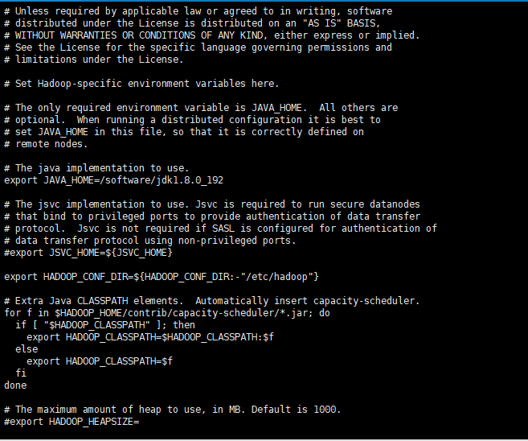

# spark集群搭建 <br>

项\节点|master|slave1|slave2|slave3|slave4
-|-|-|-|-|-
zookeeper|是|是|是|是|是
resourceManager|是| | | |是
nodeManager| |是|是|是| 
namenode|是| | | |是| 
datanode| |是|是|是| 
spark master|是| | | | 
spark worker| |是|是|是| 
jornalnode|是|是|是|是|是| 

* 总共配置了5台虚拟机，上面是每台机器上部署的信息，由于机器有限，把namenode和resourceManager放在了同一台机器上，生产环境最好是分开。  
* 虚拟软件：VirtualBox  
* 操作系统版本：CentOS-7-x86_64-DVD-1810.iso  
* JDK版本：jdk8 最先使用jdk10 ，但是在部署spark过程中有问题，后来改为jdk8  
* hadoop版本：hadoop-2.9.2  
* spark版本：spark-2.0.2-bin-hadoop2.7，最先使用spark-2.3.0-bin-hadoop2.7版本，但是使用过程有问题  
* scala版本：scala-2.12.8  


## 环境安装  
* VirtualBox安装不讲了，我使用桥接网络。  
* 配置hostname  
vim /etc/sysconfig/network，输入NETWORKING=yes,HOSTNAME=master  
  
修改hosts  
vim /etc/hosts  与上面配置的HOSTNAME=master对应,并把所有的机器的都配上  
  
* 配置固定IP地址  
vim /etc/sysconfig/network-scripts/ifcfg-enp0s3  
BOOTPROTO=static  
ONBOOT=yes  
IPADDR=ip地址  
NETMASK=255.255.255.0  
GATEWAY=网关  
DNS1=  
  
* 关闭防火墙  
systemctl stop firewalld.service  
systemctl disable firewalld.service  
* ssh免密登录  
ssh-keygen -t rsa，一直回车，直到完成  
cd ~/.ssh查看，下面已经有id_rsa,id_rsa.pub两个文件，说明成功了  
然后使用ssh-copy-id -i ~/.ssh/id_rsa.pub master，copy到每一台机器，包括本机  
上面的步骤在其他的机器上也执行一次  
然后使用ssh slave1 命令检查是否配置成功  

## 软件安装  
* jdk安装  
使用tar -zxvf jdk-8u192-linux-x64.tar.gz解压  
vim /etc/profile,配置环境变量  
执行source /etc/profile 命令使环境变量生效  
拷贝到其他机器上，安装一样  
输入java ，javac 命令检查是否安装成功  
* hadoop安装  
1 先解压  
2 配置环境变量  
3 环境变量生效  
4 使用hadoop version 检查是否安装成功  
5 在hadoop目录中修改配置，具体目录hadoop/etc/hadoop,修改hadoop-env.sh文件，在其中加入JAVA_HOME
  
6 修改core-site.xml文件  
```
<configuration>
<!--指定hdfs的namenode节点-->
	<property>
                  <name>fs.defaultFS</name>
                  <value>hdfs://ns1</value>
         </property>
<!-- 指定hadoop临时目录 -->
                    <property>
                        <name>hadoop.tmp.dir</name>
                        <value>/software/hadoop_tmp</value>
                    </property>
<!-- 指定zookeeper地址 -->
                    <property>
                        <name>ha.zookeeper.quorum</name>
                        <value>master:2181,slave1:2181,slave2:2181,slave3:2181,slave4:2181</value>
                    </property>
</configuration>

```  
7 修改hdfs-site.xml  
```

<configuration>
                <!--指定hdfs的nameservice为ns1，需要和core-site.xml中的保持一致 -->
                <property>
                    <name>dfs.nameservices</name>
                    <value>ns1</value>
                </property>
                <!-- ns1下面有两个NameNode，分别是nn1，nn2 -->
                <property>
                    <name>dfs.ha.namenodes.ns1</name>
                    <value>nn1,nn2</value>
                </property>
                <!-- nn1的RPC通信地址 -->
                <property>
                    <name>dfs.namenode.rpc-address.ns1.nn1</name>
                    <value>master:9000</value>
                </property>
                <!-- nn1的http通信地址 -->
                <property>
                    <name>dfs.namenode.http-address.ns1.nn1</name>
                    <value>master:50070</value>
                </property>
                <!-- nn2的RPC通信地址 -->
                <property>
                    <name>dfs.namenode.rpc-address.ns1.nn2</name>
                    <value>slave4:9000</value>
                </property>
                <!-- nn2的http通信地址 -->
                <property>
                    <name>dfs.namenode.http-address.ns1.nn2</name>
                    <value>slave4:50070</value>
                </property>
                <!-- 指定NameNode的元数据在JournalNode上的存放位置 -->
                <property>
                    <name>dfs.namenode.shared.edits.dir</name>
                    <value>qjournal://master:8485;slave1:8485;slave2:8485;slave3:8485;slave4:8485/ns1</value>
                </property>
                <!-- 指定JournalNode在本地磁盘存放数据的位置 -->
                <property>
                    <name>dfs.journalnode.edits.dir</name>
                    <value>/software/journal</value>
                </property>
                <!-- 开启NameNode失败自动切换 -->
                <property>
                    <name>dfs.ha.automatic-failover.enabled</name>
                    <value>true</value>
                </property>
                <!-- 配置失败自动切换实现方式 -->
                <property>
                    <name>dfs.client.failover.proxy.provider.ns1</name>
                    <value>org.apache.hadoop.hdfs.server.namenode.ha.ConfiguredFailoverProxyProvider</value>
                </property>
                <!-- 配置隔离机制方法，多个机制用换行分割，即每个机制暂用一行-->
                <property>
                    <name>dfs.ha.fencing.methods</name>
                    <value>
                        sshfence
                        shell(/bin/true)
                    </value>
                </property>
                <!-- 使用sshfence隔离机制时需要ssh免登陆 -->
                <property>
                    <name>dfs.ha.fencing.ssh.private-key-files</name>
                    <value>~/.ssh/id_rsa</value>
                </property>
                <!-- 配置sshfence隔离机制超时时间 -->
                <property>
                    <name>dfs.ha.fencing.ssh.connect-timeout</name>
                    <value>30000</value>
                </property>
            </configuration>

```

8 修改mapred-site.xml，没有这个文件，使用mv mapred-queues.xml.template mapred-site.xml生成一个  
修改mapred-site.xml
```
<configuration>
                    <!-- 指定mr框架为yarn方式 -->
                    <property>
                        <name>mapreduce.framework.name</name>
                        <value>yarn</value>
                    </property>
 </configuration>

```
9 修改yarn-site.xml  
```
<configuration>
                        <!-- 开启RM高可靠 -->
                        <property>
                           <name>yarn.resourcemanager.ha.enabled</name>
                           <value>true</value>
                        </property>
                        <!-- 指定RM的cluster id -->
                        <property>
                           <name>yarn.resourcemanager.cluster-id</name>
                           <value>SparkCluster</value>
                        </property>
                        <!-- 指定RM的名字 -->
                        <property>
                           <name>yarn.resourcemanager.ha.rm-ids</name>
                           <value>rm1,rm2</value>
                        </property>
                        <!-- 分别指定RM的地址 -->
                        <property>
                           <name>yarn.resourcemanager.hostname.rm1</name>
                           <value>master</value>
                        </property>
                        <property>
                           <name>yarn.resourcemanager.hostname.rm2</name>
                           <value>slave4</value>
                        </property>
                        <!-- 指定zk集群地址 -->
                        <property>
                           <name>yarn.resourcemanager.zk-address</name>
                           <value>master:2181,slave1:2181,slave2:2181,slave3:2181,slave4:2181</value>
                        </property>
                        <property>
                           <name>yarn.nodemanager.aux-services</name>
                           <value>mapreduce_shuffle</value>
                        </property>
               </configuration>

```
10 修改slaves，这里配置的是datanode节点，写hostname即可  
```
slave1
slave2
slave3

```
11 建立hadoop临时目录hadoop_tmp,与core-site.xml配置的临时目录对应,建立journal目录，用来存放journalnode在本地存放位置，  
与hdfs-site.xml中配置的目录对应

12 把hadoop拷贝到其他机器上，配置与上面的一致  

* 安装zookeeper  
解压zookeeper  
配置环境变量  
环境变量生效  
在zookeeper下找到conf目录，在下面有一个zoo_sample.cfgw文件，使用mv zoo-sample.cfg zoo.cfg 命令生成zoo.cfg文件  
建立zookeeper_data目录  
修改zoo.cfg文件，dataDir=/software/zookeeper_data，并添加如下配置  
```
server.1=master:2888:3888
server.2=slave1:2888:3888
server.3=slave2:2888:3888
server.4=slave3:2888:3888
server.5=slave4:2888:3888

```
进入zookeeper_data目录，使用touch myid命令建立myid文件，使用echo 1 > myid命令把1写入myid文件中，这里的数字与上面server.1的配置一一对应，  
比如master机器就是1，slave1机器就是2  

把zookeeper拷贝到其他的机器上，只需要修改myid中的对应数字就可以了，其他配置一样  

* scala安装  
解压  
配置环境变量  
环境变量生效  
拷贝到其他机器，配置一样  

* spark安装  
解压  
配置环境变量  
环境变量生效  
进入spark目录找到conf目录 ，使用命令cp spark-env.sh.template spark-env.sh生成一个spark-env.sh文件  
修改spark-env.sh文件，配置如下信息  
```
export SPARK_MASTER_HOST=master #配置的是spark的master节点机器
export JAVA_HOME=/software/jdk1.8.0_192
export SCALA_HOME=/software/scala-2.12.8
export HADOOP_HOME=/software/hadoop-2.9.2
export HADOOP_CONF_DIR=/software/hadoop-2.9.2/etc/hadoop #这里配置的是hadoop的配置目录
export SPARK_HOME=/software/spark-2.0.2-bin-hadoop2.7

```

进入spark目录找到conf目录，使用cp slaves.template slaves 生成一个slaves文件  
修改slaves文件，这里配置的是spark的worker节点
```
slave1
slave2
slave3

```

把spark拷贝到其他机器上，配置一致  

* 格式化hdfs，使用命令 hdfs namenode -format，在两个namenode节点上都要执行，也可以执行一台后将hadoop_tmp的信息拷贝到另一台上  
* 格式化zookeeper ，使用hdfs zkfc -formatZK
* 开始启动  
 1 启动zookeeper ，zkServer.sh start  
 2 启动hadoop ，start-all.sh 启动，这个只能启动一个resourcemanager,另一个resourcemanager需要使用  
 yarn-daemon.sh start resourcemanager来启动  
 3 启动spark，进入spark找到sbin目录，使用./start-all.sh来启动spark


