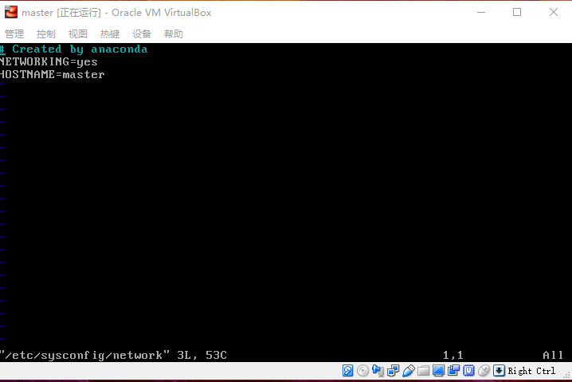
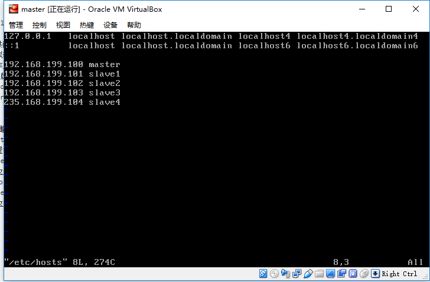
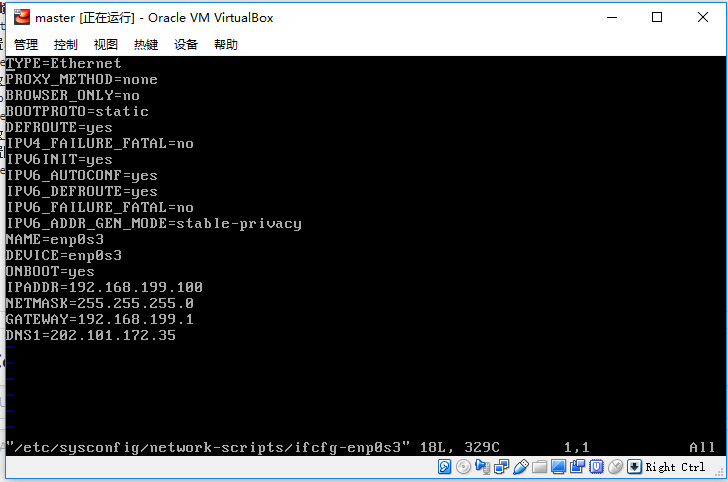

# spark集群搭建  

项\节点|master|slave1|slave2|slave3|slave4
-|-|-|-|-|-
zookeeper|是|是|是|是|是
resourceManager|是| | | |是
nodeManager| |是|是|是| 
namenode|是| | | |是| 
datanode| |是|是|是| 
spark master|是| | | | 
spark worker| |是|是|是| 
jornalnode|是|是|是|是|是| 

* 总共配置了5台虚拟机，上面是每台机器上部署的信息，由于机器有限，把namenode和resourceManager放在了同一台机器上，生产环境最好是分开。  
* 虚拟软件：VirtualBox  
* 操作系统版本：CentOS-7-x86_64-DVD-1810.iso  
* JDK版本：jdk8 最先使用jdk10 ，但是在部署spark过程中有问题，后来改为jdk8  
* hadoop版本：hadoop-2.9.2  
* spark版本：spark-2.0.2-bin-hadoop2.7，最先使用spark-2.3.0-bin-hadoop2.7版本，但是使用过程有问题  

## 环境安装  
* VirtualBox安装不讲了，我使用桥接网络。  
* 配置hostname  
vim /etc/sysconfig/network，输入NETWORKING=yes,HOSTNAME=master  
  
修改hosts  
vim /etc/hosts  与上面配置的HOSTNAME=master对应,并把所有的机器的都配上  
  
* 配置固定IP地址  
vim /etc/sysconfig/network-scripts/ifcfg-enp0s3  
BOOTPROTO=static  
ONBOOT=yes  
IPADDR=ip地址  
NETMASK=255.255.255.0  
GATEWAY=网关  
DNS1=  
  
* 关闭防火墙  
systemctl stop firewalld.service  
systemctl disable firewalld.service  
* ssh免密登录  
ssh-keygen -t rsa，一直回车，直到完成  
cd ~/.ssh查看，下面已经有id_rsa,id_rsa.pub两个文件，说明成功了  
然后使用ssh-copy-id -i ~/.ssh/id_rsa.pub master，copy到每一台机器，包括本机  
上面的步骤在其他的机器上也执行一次  
然后使用ssh slave1 命令检查是否配置成功  

## 软件安装  
* jdk安装  
使用tar -zxvf jdk-8u192-linux-x64.tar.gz解压  
vim /etc/profile,配置环境变量  
执行source /etc/profile 命令使环境变量生效  
输入java ，javac 命令检查是否安装成功  
* hadoop安装  
先解压  
配置环境变量  
环境变量生效  
使用hadoop version 检查是否安装成功  

